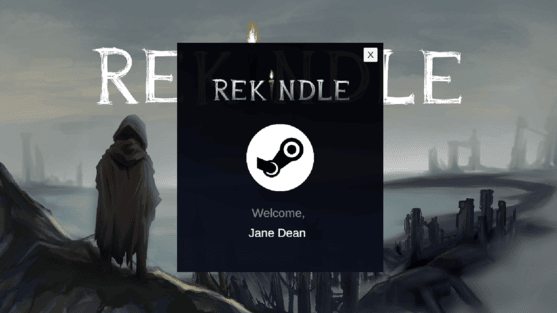

# Psyche

### Target: AB.0XY.00Z

<table>
    <tr>
        <td valign = "top">
            <h4><a href="../README.md">Revisions</a></h4>
            <h4>Site Map</h4>
            <ul>
                <li><a href="account-authentication.md">Account Authentication</a></li>
                <li><a href="account-backup-and-restoration.md">Account Backup and Restoration</a></li>
                <li><a href="area-exploration.md">Area Exploration</a></li>
                <li><a href="choice-based-narrative.md">Choice-based Narrative</a></li>
                <ul>
                    <li><a href="ruin-restoration.md">Ruin Restoration</a></li>
                </ul>
                <li><a href="progress-control.md">Progress Control</a></li>
                <ul>
                    <li><a href="progress-saving.md">Progress Saving</a></li>
                    <li><a href="progress-loading.md">Progress Loading</a></li>
                </ul>
            </ul>
             
        </td>
        <td valign ="top">   
           <a href="https://github.com/Jhanez27/psyche">Home</a> &gt; <a href="https://github.com/Jhanez27/psyche/blob/main/docs/account-authentication.md">Account Authentication</a>
              
          
          <h3>Account Authentication</h3>
        Users can create an account linked to their Steam account. The given account will be authenticated with an authentication API and Steam Cloud integration, and an account for the game will be created once verified.
        <h3>Use Case Scenario</h3>
        <table border="1">
        <tr>
            <th>Use Case</th>
            <th>Account Authentication</th>
        </tr>
        <tr>
            <th>Actor(s)</th>
            <td>Player</td>
        </tr>
        <tr>
            <th>Goal</th>
            <td>Successfully link the player to their steam account</td>
        </tr>
        <tr>
            <th>Preconditions</th>
            <td>The player must have a valid steam account.</td>
        </tr>
        <tr>
            <th>Main Scenario</th>
            <td>
                1. The player launches the game, and the game will fetch their Steam account information via SteamCloud. 
                2. The system authenticates the steam 
            </td>
        </tr>
        <tr>
            <th>Outcome</th>
            <td>The player successfully creates an account using or linking their Steam. </td>
        </tr>
    </table>
       
        </td>
    </tr>
    <tr>
        <td colspan="2">
© 2025 Spheron

</td>
    </tr>
</table>
