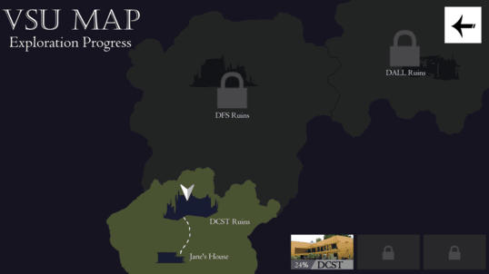

# Psyche

### Target: AB.0XY.00Z

<table>
    <tr>
        <td valign="top">
            <h4><a href="../README.md">Revisions</a></h4>
            <h4>Site Map</h4>
            <ul>
                <li><a href="account-authentication.md">Account Authentication</a></li>
                <li><a href="account-backup-and-restoration.md">Account Backup and Restoration</a></li>
                <li><a href="area-exploration.md">Area Exploration</a></li>
                <li><a href="choice-based-narrative.md">Choice-based Narrative</a></li>
                <ul>
                    <li><a href="ruin-restoration.md">Ruin Restoration</a></li>
                </ul>
                <li><a href="progress-control.md">Progress Control</a></li>
                <ul>
                    <li><a href="progress-saving.md">Progress Saving</a></li>
                    <li><a href="progress-loading.md">Progress Loading</a></li>
                </ul>
            </ul>
             
        </td>
        <td valign="top">   
          <a href="https://github.com/Jhanez27/psyche">Home</a> &gt; <a href="https://github.com/Jhanez27/psyche/blob/main/docs/area-exploration.md">Area Exploration</a>
             
            
          <h3>Area Exploration</h3>
            Selected areas of Visayas State University and included contents will be visualised and designed using pixel art, creating a cohesive map. Players can traverse and explore the map full of stories, buildings, and items.

        </td>
    </tr>
    <tr>
        <td colspan="2">
© 2025 Spheron

</td>
    </tr>
</table>
