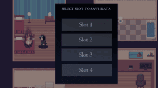
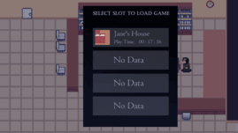

# Psyche

### Target: AB.0XY.00Z

<table>
    <tr>
        <td valign="top">
            <h4><a href="../README.md">Revisions</a></h4>
            <h4>Site Map</h4>
            <ul style="list-style-type: none; padding-left: 0;">
                <li><a href="account-authentication.md">Account Authentication</a></li>
                <li><a href="account-backup-and-restoration.md">Account Backup and Restoration</a></li>
                <li><a href="area-exploration.md">Area Exploration</a></li>
                <li><a href="choice-based-narrative.md">Choice-based Narrative</a></li>
                <ul>
                    <li><a href="ruin-restoration.md">Ruin Restoration</a></li>
                </ul>
                <li><a href="progress-control.md">Progress Control</a></li>
                <ul>
                    <li><a href="progress-saving.md">Progress Saving</a></li>
                    <li><a href="progress-loading.md">Progress Loading</a></li>
                </ul>
            </ul>
             
        </td>
        <td valign ="top"> 
         <a href="https://github.com/Jhanez27/psyche">Home</a> &gt; <a href="https://github.com/Jhanez27/psyche/blob/main/docs/progress-control.md">Progress Control</a>
             
          
          
          <h3>Progress Control</h3>
            A designated database will be created to store progress on various game elements such as areas, stories, tasks, and the like. The completion and progression of stories and areas will be reflected and written in the database.
            
            <h3>Use Case Scenario</h3>
              <table border="1">
        <tr>
            <th>Use Case</th>
            <th>Progress Control</th>
        </tr>
        <tr>
            <th>Actor(s)</th>
            <td>Player</td>
        </tr>
        <tr>
            <th>Goal</th>
            <td>Track and restore the player's progress in the game.</td>
        </tr>
        <tr>
            <th>Preconditions</th>
            <td>The game is tracking the player's progress in different areas and tasks.</td>
        </tr>
        <tr>
            <th>Main Scenario</th>
            <td>
                1. The player progresses through area, stories and task in the game. 
                2. The system records the completion in the game's database. 
                3. The player can access their progress. 
            </td>
        </tr>
        <tr>
            <th>Outcome</th>
            <td>The player's progress is continuously updated and is reflecting in the game's database.</td>
        </tr>
    </table>
             
        </td>
    </tr>
    <tr>
        <td colspan="2">
© 2025 Spheron

</td>
    </tr>
</table>
