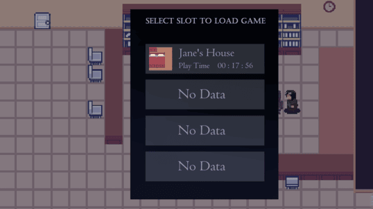

# Psyche

### Target: AB.0XY.00Z

<table>
    <tr>
        <td valign="top">
            <h4><a href="../README.md">Revisions</a></h4>
            <h4>Site Map</h4>
            <ul>
                <li><a href="account-authentication.md">Account Authentication</a></li>
                <li><a href="account-backup-and-restoration.md">Account Backup and Restoration</a></li>
                <li><a href="area-exploration.md">Area Exploration</a></li>
                <li><a href="choice-based-narrative.md">Choice-based Narrative</a></li>
                <ul>
                    <li><a href="ruin-restoration.md">Ruin Restoration</a></li>
                </ul>
                <li><a href="progress-control.md">Progress Control</a></li>
                <ul>
                    <li><a href="progress-saving.md">Progress Saving</a></li>
                    <li><a href="progress-loading.md">Progress Loading</a></li>
                </ul>
            </ul>
             
        </td>
        <td valign="top">   
        <a href="https://github.com/Jhanez27/psyche">Home</a> &gt; <a href="https://github.com/Jhanez27/psyche/blob/main/docs/progress-loading.md">Progress Loading</a>
           
          
          <h3>Progress Loading</h3>
            Players can retrieve their latest saved progress from the database and load it into their game. They can play where they have last saved and continue progressing the story from there.
            
            <h3>Use Case Scenario</h3>
              <table border="1">
        <tr>
            <th>Use Case</th>
            <th>Progress Loading</th>
        </tr>
        <tr>
            <th>Actor(s)</th>
            <td>Player</td>
        </tr>
        <tr>
            <th>Goal</th>
            <td>Load the player's recent saved progress.</td>
        </tr>
        <tr>
            <th>Preconditions</th>
            <td>The player has saved progress in the game.</td>
        </tr>
        <tr>
            <th>Main Scenario</th>
            <td>
                1. The player selects the option to load saved progress. 
                2. The system queries on the database for the player's saved progress. 
                3. The players loads the saved progress. 
                4. The player resumes the game from their last saved position. 
            </td>
        </tr>
        <tr>
            <th>Outcome</th>
            <td>The player successfully loads their latest saved progress and continues from where they left off. .</td>
        </tr>
    </table>
             
        </td>
    </tr>
    <tr>
        <td colspan="2">
© 2025 Spheron

</td>
    </tr>
</table>
