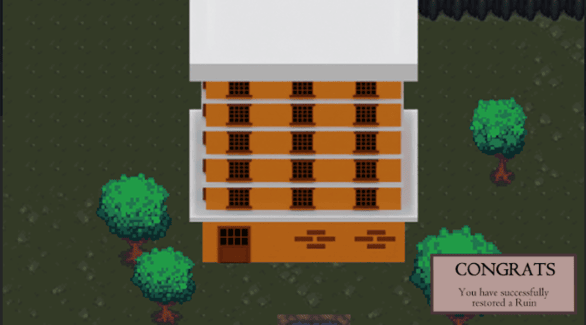

# Psyche

### Target: AB.0XY.00Z

<table>
    <tr>
        <td valign="top">
            <h4><a href="../README.md">Revisions</a></h4>
            <h4>Site Map</h4>
            <ul style="list-style-type: none; padding-left: 0;">
                <li><a href="account-authentication.md">Account Authentication</a></li>
                <li><a href="account-backup-and-restoration.md">Account Backup and Restoration</a></li>
                <li><a href="area-exploration.md">Area Exploration</a></li>
                <li><a href="choice-based-narrative.md">Choice-based Narrative</a></li>
                <ul>
                    <li><a href="ruin-restoration.md">Ruin Restoration</a></li>
                </ul>
                <li><a href="progress-control.md">Progress Control</a></li>
                <ul>
                    <li><a href="progress-saving.md">Progress Saving</a></li>
                    <li><a href="progress-loading.md">Progress Loading</a></li>
                </ul>
            </ul>
             
        </td>
        <td valign="top">   
         <a href="https://github.com/Jhanez27/psyche">Home</a> &gt; <a href="https://github.com/Jhanez27/psyche/blob/main/docs/ruin-restoration.md">Ruin Restoration</a>
            
          
          <h3>Ruin Restoration</h3>
            Certain stories are linked to a ruin and its appearance will change after the completion of a story. Additionally, features and events may be unlocked after the restoration.
            
            <h3>Use Case Scenario</h3>
              <table border="1">
        <tr>
            <th>Use Case</th>
            <th>Ruin Restoration</th>
        </tr>
        <tr>
            <th>Actor(s)</th>
            <td>Player</td>
        </tr>
        <tr>
            <th>Goal</th>
            <td>The player successfully completes the story and rebuild the ruin.</td>
        </tr>
        <tr>
            <th>Preconditions</th>
            <td>The player has unlocked a new ruin in the map.</td>
        </tr>
        <tr>
            <th>Main Scenario</th>
            <td>
                1. The player completes a storyline or the quest that is linked to a ruin. 
                2. The system triggers the restoration of the linked ruin. 
                3. The appearance of the ruin changes based on the completed story. 
            </td>
        </tr>
        <tr>
            <th>Outcome</th>
            <td>The player successfully restored the ruin.</td>
        </tr>
    </table>
             
        </td>
    </tr>
    <tr>
        <td colspan="2">
© 2025 Spheron

</td>
    </tr>
</table>
